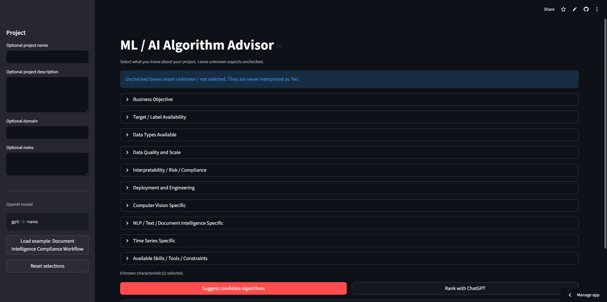
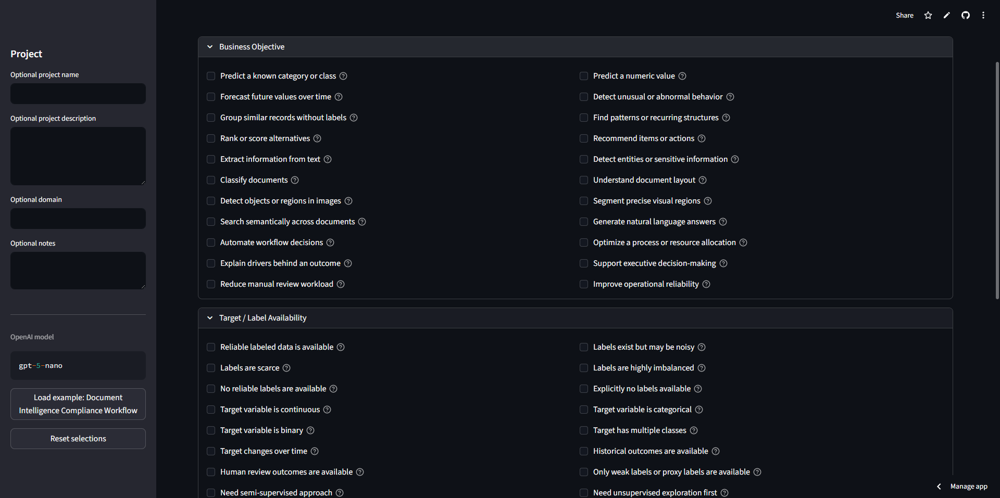
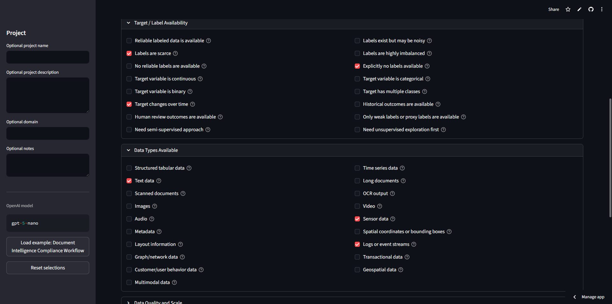
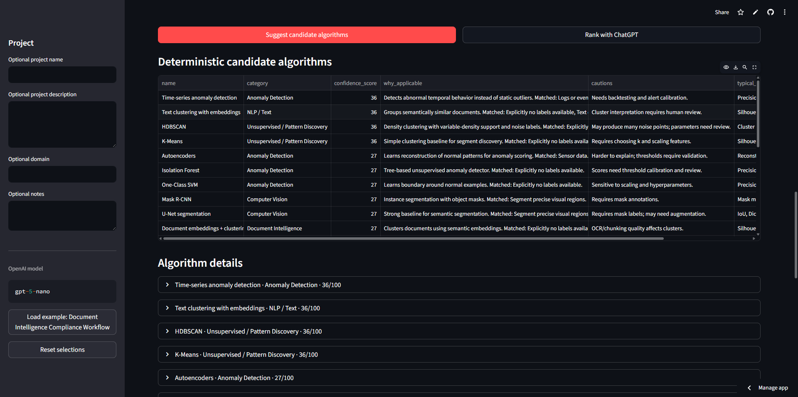
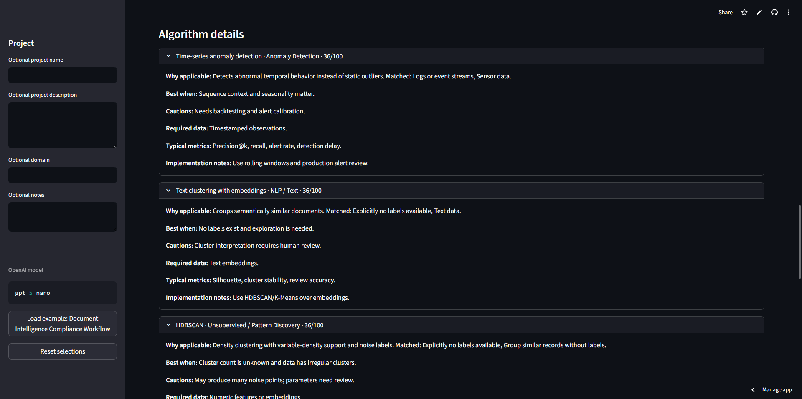
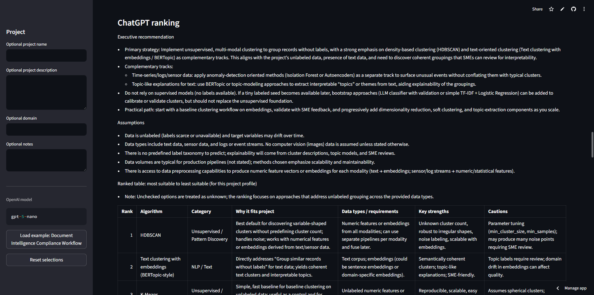
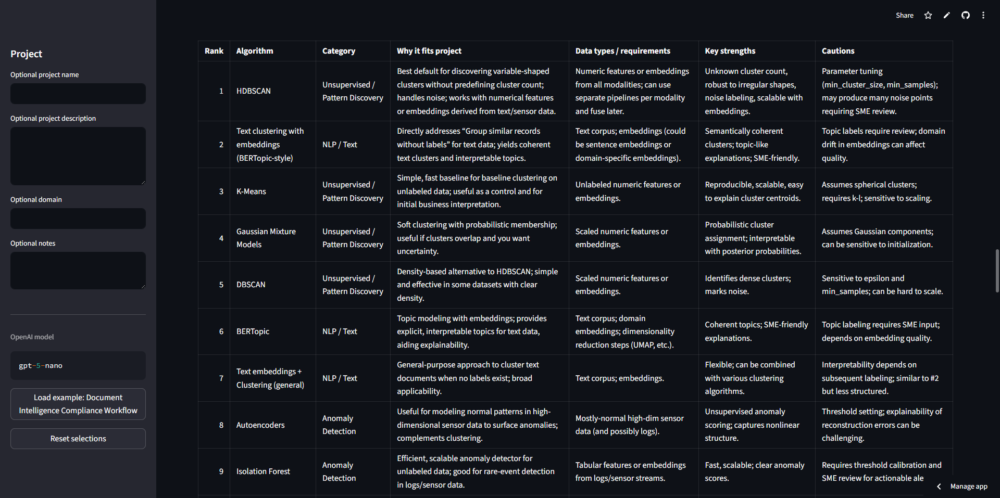

# ML / AI Algorithm Advisor

Local Streamlit application for exploring suitable machine learning, AI, data science, NLP, computer vision, time series, anomaly detection, document intelligence, optimization, GenAI, and RAG algorithm families.

The app helps users describe a project through grouped checkboxes, generates deterministic local candidate algorithms, and can optionally ask ChatGPT through the OpenAI API to rank those candidates with practical implementation guidance.

## Highlights

- Runs locally on Windows, macOS, or Linux.
- Built with Python and Streamlit.
- Deterministic recommendations work without an API key.
- ChatGPT ranking is only called when the user clicks **Rank with ChatGPT**.
- Unchecked boxes are treated as unknown, never as "No".
- Includes explicit negative options where a true negative matters.
- Exports the full project profile, candidate algorithms, and ranking as Markdown.
- Designed for ML solution architects, data scientists, AI consultants, product teams, and analytics teams.

## Quick Start

```powershell
git clone https://github.com/YOUR_USERNAME/ml-ai-algorithm-advisor.git
cd ml-ai-algorithm-advisor
python -m venv .venv
.\.venv\Scripts\Activate.ps1
python -m pip install --upgrade pip
python -m pip install -r requirements.txt
cd algorithm_advisor
streamlit run app.py
```

Open:

```text
http://localhost:8501
```

## OpenAI Configuration

The OpenAI API key is optional for local deterministic recommendations. It is required only for ChatGPT ranking.

```powershell
cd algorithm_advisor
Copy-Item .env.example .env
```

Edit `algorithm_advisor/.env`:

```env
OPENAI_API_KEY=your_api_key_here
OPENAI_MODEL=gpt-5.5
```

Never commit `.env` or API keys.

## Screenshots

### Project Profile



### Options



### Selected Options



### Deterministic Algorithm Suggestions



### Deterministic Algorithm Details



### ChatGPT Ranking





## Documentation

- [Application README](algorithm_advisor/README.md)
- [Usage Guide](docs/USAGE.md)
- [Architecture](docs/ARCHITECTURE.md)
- [OpenAI Setup](docs/OPENAI_SETUP.md)
- [Publishing to GitHub](docs/GITHUB_PUBLISHING.md)
- [Contributing](CONTRIBUTING.md)
- [Security](SECURITY.md)

## Repository Structure

```text
algorithm_advisor/
  app.py
  recommender.py
  openai_client.py
  prompts.py
  models.py
  utils.py
  requirements.txt
  README.md
  .env.example
docs/
  ARCHITECTURE.md
  GITHUB_PUBLISHING.md
  OPENAI_SETUP.md
  USAGE.md
.github/
  ISSUE_TEMPLATE/
  PULL_REQUEST_TEMPLATE.md
```

## Suggested GitHub Topics

`machine-learning`, `artificial-intelligence`, `streamlit`, `data-science`, `mlops`, `nlp`, `computer-vision`, `time-series`, `anomaly-detection`, `rag`, `genai`, `openai`, `algorithm-selection`, `document-intelligence`

## License

MIT. See [LICENSE](LICENSE).

